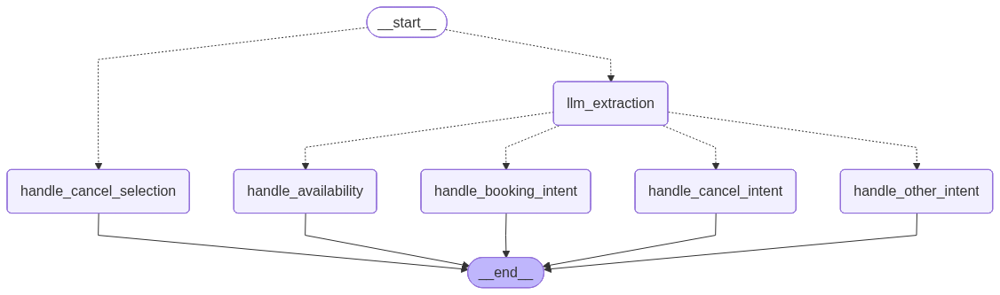

# aily — IT Consulting Booking Bot

An AI-powered IT consulting reservation bot backed by Gemini and LangGraph.  
Customers book, check availability, or cancel appointments through WhatsApp or a web chat interface.  
Staff manage reservations through a Streamlit admin dashboard.

## Features

**Customer-facing**
- WhatsApp and web chat (Streamlit) both supported
- Extracts booking intent, date, time, and availability period using Gemini structured output
- Availability inquiry — lists open dates in a requested month/weekday from live DB state
- Follow-up questions when date or time is missing
- Conflict detection — rejects double-booking within 1-hour slots
- Cancellation flow — lists active reservations by number, lets customers confirm selection
- All replies in the same language as the customer's message

**Admin dashboard (Streamlit)**
- Reservation list with filters: pending / completed / voided / cancelled
- Per-reservation detail: timestamps for completion, voiding, and cancellation
- Status transitions: mark as completed or void
- Customer conversation history viewer

## Conversation Graph



The conversation is managed as a LangGraph state machine persisted via PostgresSaver.

| Node | Trigger | Action |
|---|---|---|
| `llm_extraction` | Every message | Gemini extracts intent, date, time, period |
| `handle_availability` | `ask_availability` intent | Queries DB, returns open dates for requested month/weekday |
| `handle_booking_intent` | `book_reservation` / `update_booking_request` | Creates or updates booking request, confirms if ready |
| `handle_cancel_intent` | `cancel_reservation` intent | Lists customer's pending reservations |
| `handle_cancel_selection` | Numeric input during cancel flow | Cancels the selected reservation |
| `handle_other_intent` | `smalltalk` / `unknown` | Returns LLM reply |

## Reservation Statuses

| Status | Set by | Meaning |
|---|---|---|
| `pending` | System | Confirmed, awaiting staff review |
| `completed` | Admin | Consultation completed |
| `voided` | Admin | Invalidated by staff |
| `cancelled` | Customer | Cancelled by the customer |

## Tech Stack

- **API**: FastAPI + Uvicorn
- **Chat UI**: Streamlit (SSE streaming)
- **Admin UI**: Streamlit
- **LLM**: Google Gemini (`gemini-2.5-flash`)
- **Conversation state**: LangGraph + PostgresSaver
- **DB**: PostgreSQL 17 + pgvector
- **Schema management**: Atlas
- **Package management**: uv
- **Linting / formatting**: Ruff
- **Type checking**: mypy

## Project Structure

```
src/
├── apps/
│   ├── api/                  # FastAPI
│   │   ├── main.py           # App setup, lifespan, router registration
│   │   ├── common.py         # Shared helpers (normalize_message)
│   │   └── routers/
│   │       ├── webhook.py    # GET/POST /webhook (WhatsApp)
│   │       └── chat.py       # POST /chat (SSE streaming)
│   ├── admin/                # Admin dashboard (Streamlit, port 8501)
│   └── chat/                 # Web chat UI (Streamlit, port 8502)
└── packages/core/
    ├── config/               # Settings (pydantic-settings)
    ├── constants.py          # ReservationStatus, BookingRequestStatus, ConversationIntent
    ├── db/
    │   ├── models/           # SQLAlchemy ORM models
    │   └── repositories/     # DB access layer
    ├── graph/                # LangGraph definition
    │   ├── graph.py          # Graph builder and routing
    │   ├── nodes.py          # Node functions
    │   └── state.py          # BookingState TypedDict
    ├── infrastructure/
    │   ├── chatapp/          # WhatsApp Cloud API client
    │   └── llm/              # Gemini client
    ├── schemas/              # Pydantic schemas (BookingExtraction)
    └── usecases/             # Booking extraction (LLM prompt + parsing)
db/
└── app/schema/               # Atlas HCL schema definitions
scripts/
└── draw_graph.py             # Generate doc/graph.png
```

## Prerequisites

- Docker / Docker Compose
- [uv](https://github.com/astral-sh/uv)
- [Atlas CLI](https://atlasgo.io)
- Meta WhatsApp Cloud API credentials
- Gemini API key
- Public URL (ngrok or Cloudflare Tunnel) — WhatsApp only

## Setup

### 1. Configure environment

```bash
cp .env.example .env
```

Edit `.env` with your credentials:

| Variable | Description |
|---|---|
| `APP_BASE_URL` | Your public URL (e.g. ngrok URL) |
| `LOCAL_PUBLISH_DOMAIN` | Domain only, without `https://` |
| `VERIFY_TOKEN` | Arbitrary token for WhatsApp webhook verification |
| `WHATSAPP_TOKEN` | WhatsApp Cloud API token |
| `WHATSAPP_PHONE_NUMBER_ID` | WhatsApp phone number ID |
| `WHATSAPP_GRAPH_API_VERSION` | e.g. `v24.0` |
| `GEMINI_API_KEY` | Google Gemini API key |
| `GEMINI_MODEL` | e.g. `gemini-2.5-flash` |
| `TIMEZONE` | e.g. `Asia/Tokyo` |

### 2. Start services

```bash
make up
```

| Service | Port | Description |
|---|---|---|
| `api` | 8000 | FastAPI (WhatsApp webhook + chat API) |
| `admin` | 8501 | Admin dashboard |
| `chat` | 8502 | Web chat UI |
| `db` | 5432 | PostgreSQL + pgvector |

### 3. Apply database schema

```bash
make atlas-apply
```

### 4. Expose the local server (WhatsApp only)

```bash
make publish
```

Uses ngrok with the domain configured in `LOCAL_PUBLISH_DOMAIN`.

### 5. Configure the WhatsApp webhook

In the Meta Developer Console:

- **Callback URL**: `https://<your-domain>/webhook`
- **Verify Token**: value of `VERIFY_TOKEN` in `.env`
- **Subscribe fields**: `messages`

## Development

```bash
make all-check     # format + lint + typecheck + test

make format        # Ruff format
make lint          # Ruff lint
make typecheck     # mypy
make test          # pytest

make draw-graph    # Regenerate doc/graph.png
make update-req    # Sync requirements files from pyproject.toml
```

> **Note:** `requirements.txt` and `requirements-dev.txt` are generated from `pyproject.toml` via `uv export`.  
> A GitHub Actions workflow blocks merges when they are out of sync.

## Database Tables

| Table | Description |
|---|---|
| `customers` | Phone number (or chat session ID) and name |
| `conversations` | Per-customer chat session; `active_flow` tracks current flow state |
| `conversation_flow_cancel_items` | Reservations presented during an active cancel flow |
| `messages` | All inbound and outbound messages with raw LLM output |
| `booking_requests` | Booking info being collected (`collecting` → `ready` → `confirmed`) |
| `reservations` | Confirmed reservations with full status lifecycle |

## CI

`.github/workflows/check-requirements.yml` runs on PRs that touch `pyproject.toml` or `uv.lock` and fails if `requirements.txt` / `requirements-dev.txt` are stale.
