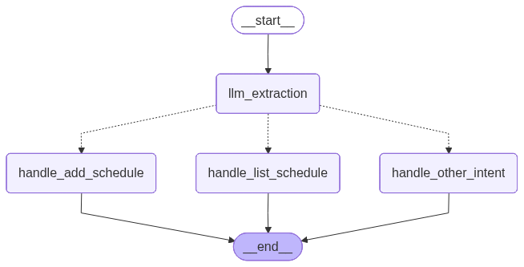

# aily — Multimodal LLMOps Platform

An end-to-end LLMOps platform built for a personal AI schedule assistant. The application itself — a web chat that registers events and tasks from natural language and images — is intentionally simple. The engineering focus is on **self-hosting a multimodal LLM on EKS with production-grade serving, observability, evaluation, and deployment infrastructure**.

> **Stack at a glance:** Python · FastAPI · LangGraph · vLLM · KServe · EKS + Karpenter · ArgoCD + Argo Rollouts · Argo Workflows · Langfuse · MLflow · Terraform

---

## Architecture

```
Browser
  │  WebSocket (Flet)
  ▼
[aily-frontend]  ──────────────────────────────────────────────────┐
                                                                    │
[aily-api]  ──  LangGraph state machine  ──  KServe InferenceService  ──  vLLM (llama3.2-vision:11b)
    │                                              │
    │  OpenLLMetry auto-instrumentation            │  Prometheus metrics
    ▼                                              ▼
[Langfuse]  (trace / eval storage)      [kube-prometheus-stack]  →  HPA
    │
[MLflow]  (model registry / artifacts on S3)
```

Image attachments are stored in S3 and served via CloudFront (OAC + SSE-KMS). Conversation state is persisted in PostgreSQL via LangGraph's `PostgresSaver` checkpointer.

---

## LLMOps Stack

### Model Serving

| Component | Choice | Why |
|---|---|---|
| Runtime | KServe (RawDeployment) + vLLM | RawDeployment avoids Knative; KServe's `InferenceService` CRD provides a unified interface for adding STT/TTS models in a later phase without reinventing each manifest |
| Model | `llama3.2-vision:11b` via vLLM | Multimodal (text + image); 11B in FP16 requires ~22 GB VRAM — fits comfortably on L40S (48 GB) with ~26 GB headroom for KV cache and image encoding |
| GPU nodes | Karpenter (`g6e.xlarge`, Spot-first) | Zero GPU cost when idle; auto-provision on demand |
| Scaling | HPA on vLLM Prometheus metrics | CPU utilization is a poor proxy for LLM load; scaling on `vllm:num_requests_waiting` and `vllm:gpu_cache_usage_factor` reacts to actual inference pressure |

Karpenter disruption budgets prevent simultaneous GPU node replacement (cold-start churn) while still allowing consolidation during off-peak hours:

```yaml
disruption:
  consolidationPolicy: WhenUnderutilized
  budgets:
    - nodes: "1"               # max 1 GPU node replaced at a time (24 h window)
      schedule: "0 0 * * *"
      duration: 24h
    - nodes: "0"               # freeze consolidation during JST core hours (UTC 0:00–12:00)
      schedule: "0 0 * * *"
      duration: 12h
  expireAfter: 720h            # force-rotate nodes every 30 days; budgets prevent mass restart
```

### Observability

- **OpenLLMetry** auto-instruments every LLM call — TTFT, TPOT, token usage, cost — with no manual span creation.
- Traces flow to **Langfuse**, which stores them alongside evaluation results for cross-version quality analysis.
- GPU utilization is scraped via NVIDIA DCGM Exporter and fed into the same Prometheus stack.
- MLflow model versions are tagged with the Langfuse prompt identifier, enabling version-level quality tracking.

### Evaluation Pipeline

Triggered manually from GitHub Actions; runs fully automated once started.

```
GitHub Actions (manual trigger, select services)
  │
  ├── 1. Spin up staging GPU node (Spot-first)
  │       Deploy vLLM with the candidate model
  │
  ├── 2. LLM-as-a-judge scoring
  │       Run test set (QA pairs, image+question pairs) against staging vLLM
  │       Rule-based checks in parallel (forbidden terms, format, latency)
  │
  └── 3. Model registration (auto, if pass)
          Upload weights to S3 → register version in MLflow
          Tag with model path + Langfuse prompt ID
          (Human reviews MLflow, manually bumps model version YAML → PR → CI → deploy)
```

Self-evaluation bias is a known limitation; the architecture keeps it explicit rather than hiding it.

### Deployment

Application deploys use **Argo Rollouts Blue/Green** to shift traffic only after the new pod passes health checks. Model version is baked into the Docker image at build time — the image is an immutable artifact that encodes exactly which model version and API code were tested together, making rollback a one-step image swap.

```
PR → merge-gate (Ruff lint + terraform plan)
       ↓ merge to main
deploy.yml  →  ECR push  →  kustomization image tag bump  →  auto-merge
                                        ↓
                             ArgoCD detects change  →  Argo Rollouts Blue/Green
```

Infrastructure changes (Terraform) are decoupled from application deploys and run on a separate manual workflow.

---

## Application

The chat application is a LangGraph state machine: each message is classified by intent, routed to the appropriate node, and the extracted schedule fields are accumulated in a `schedule_draft` until complete.



| Node | Trigger | Action |
|---|---|---|
| `llm_extraction` | Every message | Extracts intent and schedule fields; asks follow-up if any field is missing |
| `handle_add_schedule` | `add_schedule` | Accumulates fields into `schedule_draft`; confirms and commits when complete |
| `handle_list_schedule` | `list_schedule` | Returns upcoming events and tasks from DB |
| `handle_other_intent` | `smalltalk` / `unknown` | Returns LLM reply without touching schedule data |

**Interfaces:**
- **Web chat (Flet)** — server-side Python, WebSocket to browser, SSE streaming responses, multimodal image upload
- **Admin dashboard (Streamlit)** — event and task list with status

---

## Infrastructure

Managed by Terraform. `terraform-apply.yml` creates all AWS resources, fills K8s manifest placeholders, and bootstraps ArgoCD.

| Component | Role |
|---|---|
| EKS 1.32 + Karpenter | Container orchestration; GPU nodes provisioned on demand |
| KServe + vLLM | Model serving (`llama3.2-vision:11b`, multimodal) |
| Argo Rollouts | Blue/Green deploy for `aily-api` |
| ArgoCD | GitOps — watches `infra/k8s/` |
| RDS Aurora PostgreSQL | Application DB + LangGraph checkpointer |
| S3 + CloudFront (OAC) | Image attachment storage; OAC with SSE-KMS for CDN delivery |
| kube-prometheus-stack | Metrics collection; Prometheus Adapter exposes vLLM metrics to HPA |
| Langfuse + ClickHouse | LLM trace and evaluation storage |
| MLflow | Model registry; artifacts stored on S3 |

### Namespaces

| Namespace | Workloads |
|---|---|
| `aily-app` | aily-api, aily-frontend |
| `aily-ml` | vLLM InferenceService, ml-workflow, Argo Workflows |
| `aily-infra` | ArgoCD, Argo Rollouts, kube-prometheus-stack, Langfuse, MLflow |
| `karpenter` | Karpenter |

---

## Tech Stack

| Layer | Technology |
|---|---|
| API | FastAPI + Uvicorn |
| Web chat UI | Flet 0.85 (server-side Python, WebSocket) |
| Admin UI | Streamlit |
| Conversation state | LangGraph + PostgresSaver |
| LLM | OpenAI-compatible API — vLLM (EKS) / Ollama (local) |
| Tracing | OpenLLMetry → Langfuse |
| DB | PostgreSQL 17 + pgvector |
| Schema management | Atlas (HCL) |
| Image storage | S3 + CloudFront (EKS) / local filesystem (dev) |
| IaC | Terraform |
| GitOps | ArgoCD |
| Deploy strategy | Argo Rollouts (Blue/Green) |
| Evaluation pipeline | Argo Workflows |
| Model registry | MLflow + S3 |
| CI | GitHub Actions (7 workflows) |
| Package management | uv |
| Linting / formatting | Ruff |
| Type checking | mypy |

---

## Local Development

### Prerequisites

- Docker / Docker Compose
- [uv](https://github.com/astral-sh/uv)
- [Atlas CLI](https://atlasgo.io)
- An OpenAI-compatible LLM (Ollama locally, vLLM on EKS, or a cloud provider)

### Setup

```bash
cp .env.example .env
# Set LLM_BASE_URL, LLM_MODEL, DB_* and optionally Langfuse keys
make up            # Start all services
make atlas-apply   # Apply DB schema
make vllm-start    # Start local Ollama model (optional)
```

| Service | Port |
|---|---|
| FastAPI | 8000 |
| Streamlit admin | 8501 |
| Flet web chat | 8502 |
| PostgreSQL | 5432 |
| MLflow | 5000 |

```bash
make all-check   # format + lint-fix + typecheck + test
make draw-graph  # Regenerate docs/graph.png
```

### EKS access helpers

```bash
make kubeconfig       # Configure kubectl
make argocd-ui        # Port-forward ArgoCD    → localhost:18080
make monitoring-ui    # Port-forward Grafana    → localhost:13000
make mlflow-ui        # Port-forward MLflow     → localhost:15000
make langfuse-ui      # Port-forward Langfuse   → localhost:13001
make frontend-ui      # Port-forward frontend   → localhost:8502
```

---

## CI / CD

| Workflow | Trigger | What it does |
|---|---|---|
| `merge-gate.yml` | PR → main | Path-filtered gate: runs `ci` for `src/**` changes, `terraform-plan` for `infra/terraform/**` changes |
| `ci.yml` | Called by merge-gate | Ruff lint + format check (reusable) |
| `terraform-plan.yml` | Called by merge-gate / manual | `fmt` + `validate` + `plan` for test and prod in parallel; posts diff as PR comment |
| `deploy.yml` | Manual | Builds selected images (aily-api / aily-frontend / mlflow), pushes to ECR, bumps kustomization image tags, auto-merges PR |
| `terraform-apply.yml` | Manual | `terraform apply` → fills K8s placeholders → bootstraps ArgoCD → creates RDS DBs and K8s secrets |
| `destroy.yml` | Manual (test only) | Drains EKS, cleans up K8s-created AWS resources (ALB, ENI, etc.), then `terraform destroy` |
| `eks-orphan-cleanup.yml` | Manual | Audits orphaned AWS resources from EKS/Karpenter/LBC (EBS, EC2, ALB, SG, ENI, CW log groups, etc.) and prints delete commands |
